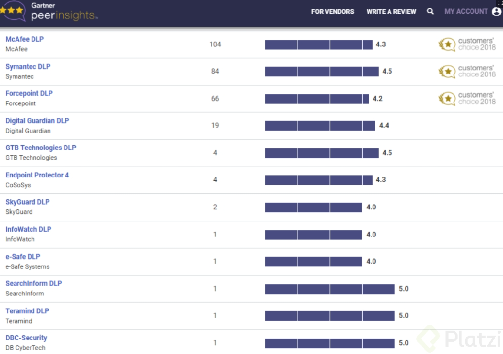

# 24 - Soluciones de Prevención de Pérdida de Datos (DLP) Empresariales

---

En el mercado existen múltiples soluciones de **Prevención de Pérdida de Datos (DLP)**, que van desde soluciones **independientes** hasta soluciones **empresariales** con mecanismos integrales de protección en todos los canales de la organización: recolección, tratamiento, alojamiento y disposición final de la información.

Las soluciones empresariales de DLP permiten:

- **Visualizar** el uso de datos en la organización.
- Aplicar **políticas dinámicas** basadas en gestión de riesgos, mediante controles parametrizables.
- **Monitorear** el flujo de información, **filtrar** datos, **generar alertas** o establecer **bloqueos**.

> El objetivo es gestionar los riesgos de pérdida involuntaria o accidental de datos, así como la exposición o filtración de datos personales o confidenciales.

---

## Mejores Soluciones según TechRadar.pro

1. **[Symantec Data Loss Prevention](https://www.broadcom.com/products/cybersecurity/information-protection/data-loss-prevention)**
2. **SecureTrust Data Loss Prevention**
3. **[McAfee Total Protection for DLP](https://www.mcafee.com/?csrc=vanity)**
4. **[Check Point Data Loss Prevention](https://www.checkpoint.com/quantum/data-loss-prevention/)**
5. **[Digital Guardian Endpoint DLP](https://www.fortra.com/platform/data-loss-prevention/endpoint-dlp)**

*Esta clasificación es muy similar a la realizada por **Gartner** en 2018.*

*Fuente: Gartner Peer Insights — Data Loss Prevention (Customers' Choice 2018).*

---

## Aportes Adicionales de Gartner

Gartner presenta además otros dos productos completos de DLP, con una **calificación de 5** a pesar de no ser los más utilizados en el mercado:

- **SearchInform DLP**
- **Terramind DLP**

---

## Referencias

*Enlaces de proveedores disponibles en [Links.md](Links.md):*

- [Best Data Loss Prevention — TechRadar](https://www.techradar.com/best/best-data-loss-prevention)
- [Symantec DLP — Broadcom](https://www.broadcom.com/products/cybersecurity/information-protection/data-loss-prevention)
- [McAfee](https://www.mcafee.com/?csrc=vanity)
- [Check Point Data Loss Prevention](https://www.checkpoint.com/quantum/data-loss-prevention/)
- [Digital Guardian Endpoint DLP — Fortra](https://www.fortra.com/platform/data-loss-prevention/endpoint-dlp)
- [DLP Reviews — Gartner](https://www.gartner.com/reviews/market/data-loss-prevention)
- [SearchInform DLP](https://es.searchinform.com/products/dlp/)
